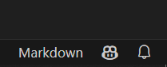

# GitHub Copilot Handson コンテンツ

# はじめに
このリポジトリは、GitHub Copilotのハンズオンコンテンツを提供するためのリポジトリです。 
Visual Studio Code、もしくはCodespacesで利用することを想定しています。

# 事前準備（既にGitHub Copilotが利用可能な方、Codespacesを利用する方はスキップしてください）
GitHub Copilotを利用するためには、以下の拡張機能が必要です。以下の拡張機能をインストールしてください。

- [GitHub Copilot](https://marketplace.visualstudio.com/items?itemName=GitHub.copilot)
- [GitHub Copilot Chat(上記のGitHub Copilotをインストールすると自動的にインストールされます)](https://marketplace.visualstudio.com/items?itemName=GitHub.copilot-chat)

インストール後、Visual Studio Codeのウインドウ右下に表示される以下のポップアップから `Sign in to GitHub` をクリックします。  

ブラウザが開き、GitHubの認証が求められるのでログインします。 
Visual Studio Codeに戻り、GitHub Copilotのアイコンが以下のように表示されていれば準備完了です。  

# 利用方法
本リポジトリをクローンし、Visual Studio Codeで開いてください。 
Codespacesを利用する方は、GitHubの画面上から `Create codespace on main` をクリックしCodespacesを起動してください。

# GitHub Copilot Chat開始方法
GitHub Copilot Chatは、左ペインの以下のアイコンをクリックすることで使用可能です。 

更に、GitHub Copilot Chatはコード上でInline Chatとしても使用可能です。 
Visual Studio 2022やVisual Studio Codeをご利用の場合は行番号をクリック後、表示される黄色の星形のアイコンをクリックしてください。

GitHub Codespacesの場合は、行番号をクリック後、表示される黄色の電球のアイコンをクリックし、`Copilotを使用して変更する`をクリックしてください。 

# ハンズオンコンテンツ
以下のディレクトリにコンテンツを用意しています。 
- [ハンズオン: コンソールアプリケーション作成（じゃんけんゲーム）](./handson/README.md)

# GitHub Copilot チートシート
GitHub Copilotの使い方については、以下のチートシートを参照してください。
| 内容 | 操作方法 |
| --- | --- |
| 全ての提案を受け入れる | `Tab` キー |
| 提案を1文字受け入れる | `Ctrl` + `→` キー |
| 提案を1文字削除する | `Ctrl` + `←` キー |
| 提案を拒否する | `Esc` キー |
| 次の提案を表示する | `Alt` + `]` キー |
| 前の提案を表示する | `Alt` + `[` キー |
| 提案をまとめて表示する | `Ctrl` + `Enter` キー |

# GitHub Copilot Chat チートシート
GitHub Copilot Chatの使い方については、以下のチートシートを参照してください。
| 内容 | 操作方法 | Chat Window | Inline Chat |
| --- | --- | --- | --- |
| 指定した指示のコードを生成する | /generate |  〇| 〇|
| コードの内容を解説させる | /explain | 〇| 〇|
| 修正を提案させる | /fix | 〇| 〇|
| テストコードを提案させる | /tests | 〇| 〇|
| コメントを書く | /dec | 〇| 〇|
| チャットの履歴を消去し、新たな会話を開始する | /newChat | 〇| X |
| 使い方を表示する | /help | 〇| 〇|
