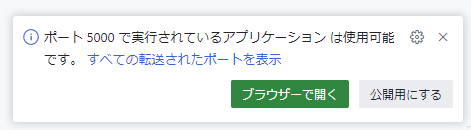
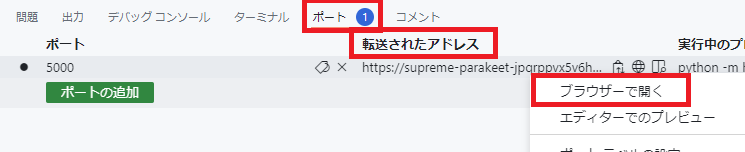

# GitHub Copilot Handson コンテンツ - Pythonを使ったじゃんけんWebアプリケーション
## はじめに
このハンズオンでは、Pythonを使ってじゃんけんゲームを作成します。  
ブラウザでアクセスし、ユーザーの入力値に対してランダムにじゃんけんの手を出し、勝敗を判定します。

## 始め方
本README.mdと同ディレクトリにある app.py を実行します。  
Codespacesのターミナルで以下のコマンドを実行します。

```bash
cd /workspaces/copilot-handson-janken/handson-webapp/
python app.py
```

実行すると、ウインドウ右下に以下のようなポップアップが表示されます。「ブラウザーで開く」ボタンをクリックすると、ブラウザでアプリケーションを表示します。  



もしポップアップが表示されない場合は、ターミナルの右の「ポート」タブの「転送されたアドレス」を右クリックし「ブラウザーで開く」を選択してください。



表示される画面は [templates/index.html](templates/index.html) に記述されています。


このHTMLの中身を見ると、以下の情報が読み取れます。

- じゃんけんの手を選択するラジオボタンが3つある
- じゃんけんの手は、rock, paper, scissors として表現され、choice という名前で送信される
- Submitボタンをクリックすると、POSTリクエストが送信される
- result という名前の変数に結果を格納してレンダリングしたとき、結果が表示される
- ユーザーが選択したじゃんけんの手は user、コンピューターの選択したじゃんけんの手は computer という変数に格納しレンダリングする

以上の情報をもとに、GitHub Copilot/GitHub Copilot Chat を利用しながらPythonのコードを書いていきましょう。[app.py](app.py) の `# ここにじゃんけんゲームの処理を記述する` のコメントの次の行からコードを記述してください。

[sample/app.py](sample/app.py) に完成品のサンプルを用意しています。
作成に行き詰まった場合は参考にしてください。

## Appendix: Azure へのデプロイ
Azure のアカウントをお持ちの方は、このアプリケーションを Azure にデプロイしてみましょう。Azure には Web アプリケーションを簡単にデプロイできる [App Service](https://azure.microsoft.com/ja-jp/products/app-service) というサービスがあります。以下の手順を実行し、Azure にアプリケーションをデプロイしてみましょう。  
Codespaces のターミナルで以下のコマンドを実行します。

1. Azure CLI で Azure にログインします。
    
    ```bash
    # use
    az login --use-device-code
    ```
    上記コマンド実行後、ブラウザの別タブを開きhttps://microsoft.com/devicelogin にアクセスします。  
    コンソール上に表示されたコードを上記ページで入力してログインしてください。

3. Azure CLI で App Service にデプロイするためのリソースグループを作成します。

    ```bash
    az group create --name copilot-handson-janken --location japaneast
    ```

4. App Service でアプリケーションを起動します。F1 プランは無料プランです。
`<Webアプリの名前を指定>` には任意の名前を指定してください。アルファベット、数字、ハイフンのみ使用可能です。

    ```bash
    cd /workspaces/copilot-handson-janken/handson-webapp/
    az webapp up -n <Webアプリの名前を指定> -g copilot-handson-janken -l japaneast --sku F1 --runtime "PYTHON|3.12"
    ```

5. ブラウザで以下の URL にアクセスしてください。
`<Webアプリの名前を指定>` には先ほど指定した名前を指定してください。

    ```
    https://<Webアプリの名前を指定>.azurewebsites.net
    ```


6. 確認後、リソースグループを削除することで作成した環境をクリーンアップできます。

    ```bash
    az group delete --name copilot-handson-janken
    ```
