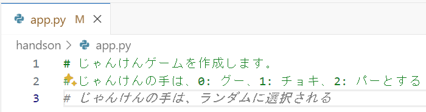
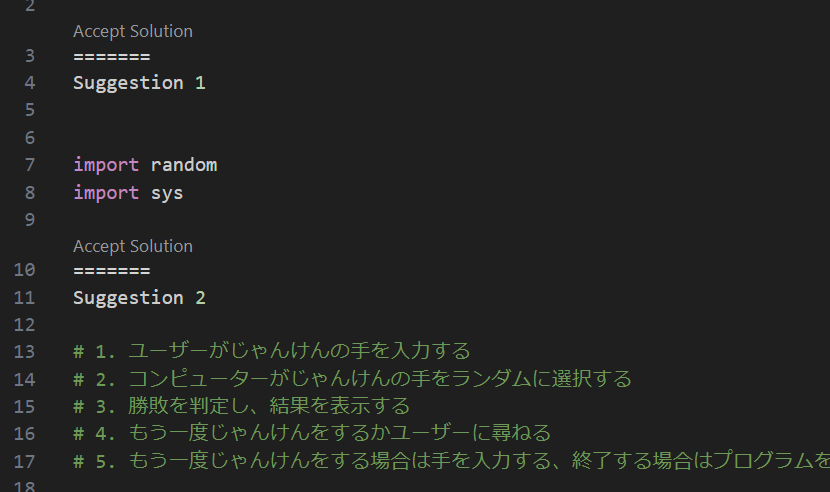
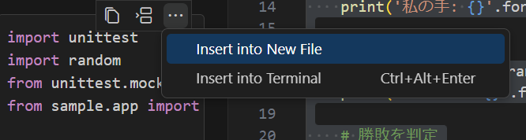

# GitHub Copilot Handson コンテンツ - Pythonを使ったじゃんけんゲーム
## はじめに
このハンズオンでは、Pythonを使ってじゃんけんゲームを作成します。  
コンソールから起動し、ユーザーの入力値に対してランダムにじゃんけんの手を出し、勝敗を判定します。

## 始め方
本README.mdと同ディレクトリにある app.py を開いてください。初期状態は空のファイルです。
こちらにコメントを記述し、GitHub Copilotが提案するコードを利用しながら、じゃんけんゲームを作成していきます。

1行目に以下のコメントを記述します。

```python
# じゃんけんゲームを作成します。
# じゃんけんの手は、0: グー、1: チョキ、2: パーとする
```

コメントを記述し、Enterキーを押して改行します。すると、GitHub Copilotが提案するコード or コメントが薄いグレーの文字で表示されます。



提案された内容を確認し、利用する場合はTabキーを押して選択します。  
提案内容が意図するものではなかった場合、Altキー+] を押すと新しい提案を表示します。目的に合った内容が表示されたらTabキーを押して採用します。  
複数の提案をまとめて表示したい場合は、Ctrlキー+Enterを押すと別タブで提案をまとめて表示します。  



複数の提案の中から意に沿ったものを選び、提案の `Accept Solution` のリンクをクリックすると、その提案が選択されます。  
どのような提案が表示されるかはその時の状況によりますが、以下のようにじゃんけんゲームのルールを示すコメントを採用するとよいでしょう。

```python
# じゃんけんゲームを作成する
# じゃんけんの手は、0: グー、1: チョキ、2: パーとする
# じゃんけんの手を入力すると、コンピュータの手と勝敗が表示される
# じゃんけんの手は、標準入力から受け取る
# じゃんけんの手は、整数値で受け取る
# じゃんけんの手は、整数値以外が入力された場合は、再入力を求める
# じゃんけんの手を入力すると、コンピュータの手と勝敗が表示される
# コンピュータの手は、乱数で生成する
# 勝敗は、じゃんけんのルールに従う
```

提案される内容を取捨選択しながら、じゃんけんゲームを作成していきます。  
実行できる状態まで作成できたらファイルを保存し、コンソールからじゃんけんゲームをプレイしてみましょう。

```bash
python3 app.py
```

# うまく動かなかった場合
GitHub Copilot Chatを利用して、どのような問題が発生しているかを調査してみましょう。
Visual Studio Codeの左メニューにある以下のアイコンをクリックし、GitHub Copilot Chatを開きます。


app.pyのコードを全行選択した状態で、チャットの入力ボックスに `選択した範囲のコードの処理内容を説明してください` と入力しEnterを押します。日本語で指示を入力する代わりに`/explain` としても構いません。  

すると、GitHub Copilot Chatが選択した範囲のコードの処理内容を説明してくれます。説明された内容を参考に、問題を解決してみましょう。

問題が解決できない場合は、GitHub Copilot Chatに修正を指示してみましょう。  
`選択した範囲のコードを修正してください` もしくは `/fix` と入力しEnterを押します。  
問題点が明らかになっているのであれば、その旨を伝えるのもよいでしょう。例えば以下のような指示です。

```
あなたの手が0、相手の手が0の時でもあいこではなく負けと表示されてしまいます。問題点を教えてください。
```

このように、GitHub Copilot Chatを問題解決に活用していきます。

# うまく動いた場合
じゃんけんゲームがうまく動いたら、ルールを拡張しグー・チョキ・パー以外の手を追加してみましょう。  
作成したコードを削除し、コメントで以下のようにルールを拡張します。

```python
# じゃんけんゲームを作成します。
# じゃんけんの手は、0: グー、1: チョキ、2: パー、3: ライオン、4: エレファント、5: マウスとします。
```

このコメントを基に、GitHub Copilotが提案するコードを利用しながらじゃんけんゲームを拡張していきましょう。

# テストコードを生成する
上記のようにルールを拡張すると、入力値が増えるため動作確認が大変です。そこで、じゃんけんゲームに対するテストコードを生成してみましょう。  
テストを実行しやすくするために、じゃんけんの手を決める関数と勝敗を判定する関数を分離するとよいでしょう。

```python
# じゃんけんの勝敗を判定する
# @param hand: じゃんけんの手
# @param computer_hand: コンピュータの手
# @return じゃんけんの勝敗
def judge(hand, computer_hand):
    ～省略～

# ユーザーのじゃんけんの手を受け取り、コンピューターの手とともにjudge関数に渡す
# ユーザーとコンピューターの手をそれぞれ日本語で表示する
# judge関数の結果を標準出力に出力する
def main():
    ～省略～
```

app.pyのコードの `judge` 関数部分を選択した状態で、チャットの入力ボックスに `テストコードを生成してください` と入力しEnterを押します。日本語で指示を入力する代わりに`/tests` としても構いません。
テスト用のコードが提示されたら、コードの右上に表示されるメニューから、`Insert into New FIle` を選択し、新しいファイルを作成します。  


作成したファイルを保存したら、テストコードを実行してみましょう。

```bash
python3 test_app.py
```

テストコードについても、必ずしも完全なものが提示されるわけではありません。必要に応じて修正を指示したり、人手で修正を加えていきましょう。

# Appendix
お時間がある方は以下のような拡張を行ってみましょう。

- どちらかが10回勝利するまで、じゃんけんを繰り返す
- どちらかが3回連続で勝利した場合、メッセージを表示する
- じゃんけんの手を入力する際に、日本語で入力できるようにする
- じゃんけんの手を入力する際に、想定外の入力があった場合は、再入力を求める
- じゃんけんの手を入力する際に、想定外の入力があった場合は、エラーメッセージを表示して終了する

拡張を行う際に、コメントでルールを記述し、GitHub Copilotが提案するコードを利用していくと、GitHub Copilotの利用方法をより理解できるでしょう。もちろん、GitHub Copilot Chatを利用して問題の解決やコードの生成を指示しても構いません。  
作業を通じ、GitHub Copilotへの指示の仕方や利用法に習熟していきましょう。

# まとめ
GitHub Copilotを利用したじゃんけんゲームの作成を通じて、GitHub Copilotの利用方法を学びました。
また、GitHub Copilot Chatを利用して、問題の解決やコードの生成を指示する方法も学びました。

`sample` ディレクトリにはじゃんけんゲーム(グー・チョキ・パーのみ)のサンプルコードが格納されています。必要に応じて参照してください。  
なお、サンプルコードもGitHub Copilotを利用して作成されたものです。